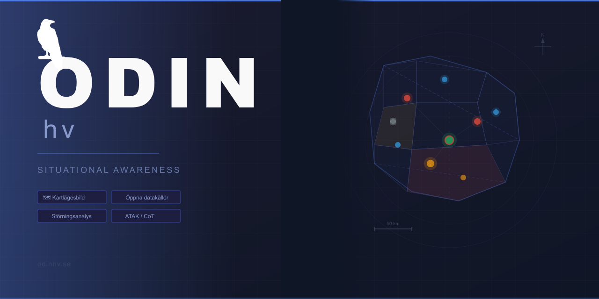
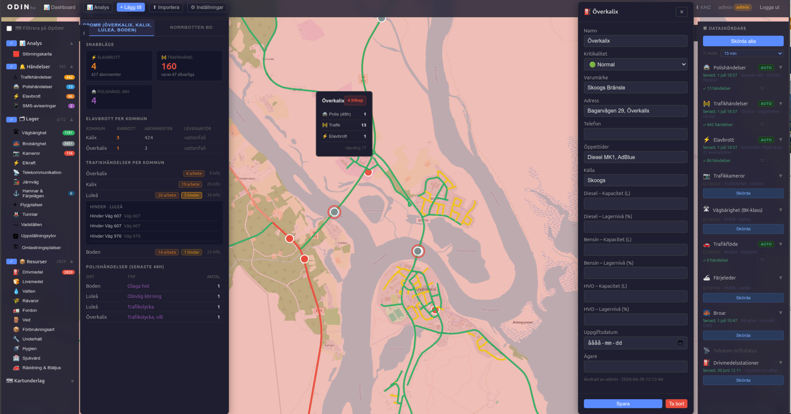

# ODIN hv



**Open Data Intelligence Node — Hemvärnet**

ODIN hv är ett kartbaserat situationsmedvetenhetssystem för Hemvärnet. Systemet samlar realtidsdata från öppna källor — Trafikverkets vägnät och kameror, polisens händelse-API, kommunala driftstörningar och OpenStreetMap — och presenterar det som en enhetlig lägesbild på karta. Syftet är att ge Hemvärnets ledning och chefer ett snabbt och samlat underlag för planering, prioritering och samordning av resurser vid övning och insats.

**Domän:** odinhv.se · resurslage.jv10.se (legacy)
**Repo:** https://github.com/SGL70/odin-hv

---

## Metodik: Activity-based Intelligence

ODIN hv:s arbetssätt utgår från ABI:s fyra pelare:

- **Georeference to Discover** — all data kopplas först till plats och tid; spatiotemporal korrelation låter mönster framträda även när plats/tid är det enda gemensamma för i övrigt disparata källor.
- **Data Neutrality** — alla datakällor är lika mycket värda oavsett klassning eller ursprung; öppna källor (OSINT) vägs inte lägre än andra flöden.
- **Sequence Neutrality** — data samlas in och lagras innan dess betydelse är känd; en pusselbit som skördas idag kan visa sig avgörande för en händelse månader senare.
- **Integration before Exploitation** — olika datatyper (multi-INT) integreras i en gemensam bild tidigt, i stället för att analyseras separat i stuprör.

Kartlagren, dataskördarna och den enhetliga lägesbilden är redan uttryck för detta, men principerna ska vara ett uttalat underlag för prioritering av fortsatt utveckling (se Roadmap).

---

## Vad som är gjort



### Karta & lägesbild
- 28 kartlager (logistik, infrastruktur, händelser) — JWT-skyddade, WebSocket-realtid
- Kritikalitetsmärkning på alla objekt: Normal / Viktig (gul) / Kritisk (röd) med visuell ring på kartan
- BK-klassfärger på vägar (grön/gul/orange/röd) från Trafikverkets NVDB
- Live-kamerabild i objektpanelen med auto-refresh var 30 s
- WMS-overlays: Lantmäteriet Terrängskuggning, SVK Kraftnät
- CSV/GeoJSON-import, KMZ + CoT-export (ATAK/WinTAK-kompatibel)
- UI-inställningar (sidopanel, kartunderlag, synliga lager m.m.) sparade per användarkonto — följer med mellan enheter, inte bara i webbläsarens localStorage

### Dataskördare
Automatisk insamling från öppna källor, konfigurerbar auto-refresh:

| Källa | Data |
|-------|------|
| polisen.se | Polishändelser för OpOmr |
| IT Norrbotten Stadsnät | Elavbrott per kommun |
| Trafikverket / DATEX II | Trafikkameror, ATK-kameror, trafikflöde |
| Trafikverket NVDB | Vägbärighet (BK-klass), färjeleder |
| OSM Overpass | Drivmedelsstationer, broar (bärighet/maxvikt) |

### Analys & störningskarta
- Störningskarta (choropleth) med kommunpolygoner — score normaliserat per 1 000 invånare (SCB 2024)
- Dagliga snapshots kl 00:05 med konfigurerbar retention
- Drill-down per händelsetyp och kommun

### Operativt Område (OpOmr)
- Välj valfria kommuner ur alla 21 svenska län som operativt område
- Kartfiltret och dataskördare begränsas automatiskt till valda kommuner
- Auto-refresh: kartlager laddas om automatiskt när OpOmr ändras

### Infrastruktur
- JWT-autentisering med roller: läsare / redaktör / admin
- Användarhantering direkt i appen (Inställningar → Användare) — skapa/ta bort konton utan databasåtkomst
- Körs som Docker Compose i Debian 12 LXC (CT 217) bakom Cloudflare Tunnel
- Tillgänglig på odinhv.se (publikt) och odin.lan (lokalt)

### Varningsregler
- Regelmotor med tre regeltyper, utvärderas automatiskt efter varje skördning:
  - Tröskel: kommunens störningspoäng överstiger X
  - Proximity: objekt i valt lager inom X m från infrastruktur med kritikalitet Viktig/Kritisk
  - Kluster: N liknande händelser inom valbar radie
- Regler hanteras av admin (⚙ Hantera regler i sidopanelen); varningar är kvitterbara av alla roller
- Realtidsnotis via Socket.io: banner + persistent lista i sidopanelen

### ABI-åtgärder (2026-07-04)
Fyra konkreta åtgärder mot gap identifierade i en ABI-bedömning (se Metodik ovan):
- **Sekvensneutralitet:** rådata som annars skulle raderas vid skördning/TTL flyttas till `features_history` i stället (`archiveAndDelete()` i harvest.js), läsbar via `GET /api/features/history`
- **Dataneutralitet:** störningspoängen har en generisk, admin-konfigurerbar källviktning (`layer_weighting`-inställning) i stället för tre hårdkodade källor — railway_situations ingår nu som default
- **Integration before exploitation:** ny "Relaterade objekt"-sektion i objektpanelen korrelerar det valda objektet mot andra features inom valbar radie (`GET /api/features/:uid/related`)
- **Georeference to discover:** alla skördade objekt normaliseras till ett gemensamt `attributes.occurred_at` (härlett från källans egen tidsnyckel) för tvärlager-tidskorrelation

### Designredesign (2026-07-04)
Konsoliderat designsystem framtaget via Claude Design, implementerat rakt igenom UI:et:
- Enhetliga designtokens (färg, typografi, radius, spacing) i stället för ad hoc-värden
- Konsekvent SVG-linjeikonspråk för alla 28 kartlager i stället för emoji — löser bl.a. att ⚡ återanvändes för både Elkraft och Elavbrott
- Choropleth (störningskarta) fick tre avgränsade kontrastfärger + legend i stället för en heltäckande halvtransparent ton
- Läsbara svenska meningar i varningsregel-listan i stället för interna fältnamn (`police_events`, `rod`)
- `FeaturePanel` + `HarvestSidebar` slogs ihop till en tabbad högerpanel (Objekt / Skördare) — båda hålls monterade så en pågående skördning inte avbryts vid flikbyte
- "+ 7S"-knapp (tidigare "+ Lägg till") väljer Underrättelserapporter som förvalt lager; en nålmarkör visas på platsen tills objektet sparats

### Catch-up-modal vid inloggning (2026-07-04)
Loggar man in efter mer än 8 timmar sedan förra inloggningen visas en modal med två sektioner, i prioriteringsordning:
- **🔔 Larm du missat** — öppna varningar skapade sedan förra inloggningen, kvitterbara direkt i modalen
- **🆕 Nytt i appen** — handskriven changelog över funktioner som tillkommit sedan dess

Går att avfärda med ✕ men kan öppnas igen under sessionen via en knapp i topheadern. Första inloggningen någonsin visar aldrig modalen.

### SMS-aviseringar & Tips via SMS (2026-07-04)
46elks-webhooken (`POST /api/sms/incoming`) delar nu upp inkommande SMS i två flöden i stället för att auto-placera allt:
- **SMS-aviseringar** — kända avsändare (kommunala VA-/elbolag m.fl.) auto-placeras som en `sms_alerts`-feature på sin registrerade plats, precis som tidigare
- **Tips via SMS** — okända avsändare hamnar i en granskningsinkorg (📨 Tips-knapp med räknare i topbaren) i stället för att gissa en Norrbotten-mittpunkt. Geotaggas manuellt via Län/Kommun/Område-dropdowns, med valfri finjustering genom att klicka på kartan, innan de blir ett riktigt objekt
- **Avsändarregister** — ny flik i Inställningar listar alla nummer som någonsin hörts av; admin kan sätta ett nummer som känt (etikett + kommun) eller blockera det, utan att koda om

### Persistent identitet vid skördning (2026-07-05)
Skördade lager (broar, vägar m.fl.) raderade och återskapade tidigare alla rader vid varje körning, så namnändringar/kritikalitetsmärkning/`target_uid`-varningsregler gick förlorade vid nästa skördning:
- `captureIdentity()` i harvest.js matchar mot en stabil extern nyckel som redan hämtades men slängdes tidigare (NVDB `GID`, OSM `way/id`, Polisen-id, avbrott.se-id, Trafikverkets `SiteId`) och bevarar `uid`, kritikalitet och eget namn vid omskördning i stället för att radera blint
- Lantmäteriet Topo blev standardkartunderlag i samma PR

### Mediabevakning (2026-07-05)
Automatisk RSS-skördning av lokala nyhetskällor som ytterligare underrättelsekälla vid sidan av Trafikverket/polisen:
- Skördar SVT Nyheter Norrbotten, SR P4 Norrbotten, TV4 Nyheterna och Norrbottens-Kuriren var 10:e minut (NSD uteslöts — samma NTM-koncern som Kuriren, dubblettinnehåll)
- Granskningsinkorg ("📰 Nyheter", samma mönster som Tips via SMS) — en rubrik blir inte ett kartobjekt förrän någon geotaggar den manuellt (kommun/område eller finjustering via kartklick)
- "Ta bort" raderar aldrig — posten flyttas till en Läst-lista (Slasken) längst ned, återställningsbar
- Egna källor läggs till i Inställningar → Nyhetskällor; systemet försöker automatiskt hitta en RSS/Atom-feed för en godtycklig URL (egen sida, `<link rel="alternate">`, eller vanliga gissningsvägar) innan källan sparas
- Manuell "🔄 Uppdatera alla källor nu"-knapp, utöver den schemalagda pollningen

### Mobil fältrapportering / PWA (2026-07-05)
Avskalad `/report`-vy för rapportering direkt i fält, installerbar som PWA:
- Auto-GPS, kamerabild (nedskalad client-side före uppladdning), touch-vänligt formulär byggt av det valda lagrets fältkonfiguration
- Rapporter skapas direkt som riktiga kartobjekt (till skillnad från Tips via SMS/Mediabevakning — inloggad användare med riktig GPS, annan förtroendemodell) men med `attributes.unclassified` satt tills en stabsmedlem granskat dem; "🚩 Oklassade"-räknare och kant-markering på kartan tills dess, "✓ Markera som klassad" i objektpanelen
- STANAG 2511-bedömningen (källans tillförlitlighet/uppgiftens trovärdighet) visas medvetet inte i fältformuläret — den görs av granskaren, inte av observatören
- Handrullad IndexedDB-kö vid utebliven mobiltäckning, skickas automatiskt när anslutningen är tillbaka
- Egen lazy-laddad bundle så fältvyn inte drar in hela kart-/MapLibre-koden (~2 MB) på dålig uppkoppling

### Mobil kartvy (2026-07-05)
Ny förmåga i samma mobil-PWA, utifrån en mockup med tre use cases — lägger inget till skrivbordskartan eller fältrapportformuläret, som är oförändrade:
- Hamburgermeny (☰) öppnar lagermenyn (Analys/Händelser/Lager/Resurser) som overlay — återanvänder skrivbordets sidopanel rakt av
- Tryck på en markör öppnar ett read-only bottom sheet med objektets fält, plus "✓ Markera som klassad" för oklassade fältrapporter
- "+"-knappen växlar till fältrapportformuläret internt (samma installerade app, ingen sidladdning) i stället för att bygga om skapa-flödet
- Endast punkt-representerbara lager visas på mobilkartan (samma uteslutning som fältrapportering redan använder för linje-/polygonlager)
- Delad kartkonfiguration (`lib/mapConfig.ts`) mellan skrivbord och mobil, så mobilappen bara laddar ner det gemensamt nödvändiga MapLibre-biblioteket — inte skrivbordets fulla kartkomponent
- Mobila webbläsare som surfar in på huvudadressen (utan att känna till `/report`) får automatiskt samma mobilvy; pinch-zoom är låst till kartan i stället för att zooma hela sidan

### Auto-skördning vid OpOmr-byte (2026-07-06)
Ändras kommunvalet i Inställningar → Operativt område triggas de 8 OpOmr-filtrerade källorna om automatiskt (Polishändelser, Trafikhändelser, Trafikkameror, ATK-kameror, Vägbärighet, Färjeleder, Trafikflöde, Tågstörningar), i stället för att kräva manuell "Skörda alla". `power`/`bridges`/`fuel`-källorna är inte kommunbegränsade och rörs inte. Ingen backend-ändring — återanvänder samma scrape-endpoints som "Skörda alla" redan gör, bara triggat automatiskt när valet faktiskt ändras.

### Kartklick- och panelfixar (2026-07-06)
- Klick på kritikalitets-/oklassad-ringen runt en markör (den större, mest synliga cirkeln) registrerades tidigare inte alls — bara den lilla mittprickens hit-area fångades av den globala klick-hanteraren
- Klick på en rad i "Oklassade"-listan stänger nu listan automatiskt så klassificeringsdialogen inte kan skymmas av den
- De sex vänsterpanelerna (Analys/Rapporter/Kritiska objekt/Oklassade/Tips/Nyheter) delade tidigare skärmposition men styrdes av oberoende booleaner och kunde staplas osynligt på varandra — nu ömsesidigt uteslutande, bara en åt gången

### Polygon- och mätverktyg (2026-07-06)
Två nya kartverktyg för egen avläsning, inga databasobjekt skapas:
- **📐 Polygon** — klicka minst 3 hörn på kartan, läs av ytan (m²/ha/km²) live medan man ritar
- **📏 Mät** — klicka minst 2 punkter, läs av sträckan (m/km) live
- Rensa/Stäng/Escape återställer ritningen; ömsesidigt uteslutet mot "+ 7S"-läget (kan inte vara aktiva samtidigt)

---

## Roadmap

Prioriteringen nedan väger även mot ABI-pelarna (se Metodik ovan) — t.ex. stärker Underrättelserapport-modulen (7 S:en) *sekvensneutralitet* genom strukturerad loggning oavsett omedelbar tolkning, och Mobildata-integration stärker *dataneutralitet* genom fler jämbördiga källor.

### Prioriterat

1. **Krisinformation.se API:er** — utreda om Krisinformations öppna data har relevanta källor att integrera (liknande utredningen som gjordes för Sjöfartsverket)

2. **Videoströmmar från drönare** — realtids- eller nära-realtidsvideo i FeaturePanel (nytt lager, samma mönster som dagens `photo_url`-kameror men video i stället för stillbild). Kräver en självhostad relay (RTSP/RTMP → WebRTC eller HLS, t.ex. MediaMTX/go2rtc) som ny docker-compose-tjänst, eftersom webbläsare inte kan spela råa drönarströmmar direkt. Ingen drönare tillgänglig för test i nuläget — se separat plan innan implementation påbörjas

### Backlog

3. **Mobildata-integration** — självkonfigurabel via inställningar (URL, nyckel, dokumentationslänk)

4. **Trendvisning** — linjediagram i analyspanelen (snapshot-historik finns, UI saknas)

5. **Rutting** med fordonsklassbegränsning (OpenRouteService)

6. **Kommentarsfuntktion på objekt** - Genom att kommentera (och tagga kollegor??) flaggar man upp saker som behöver flera ögon och hjärnor.

7. **Ta fram utbildningsmaterial** — filmer/screencasts och genomgångar utöver den befintliga textbaserade användarguiden (`/docs`), för onboarding av nya användare

8. **Ta fram API endpoints för integration mot överordnade system** - Skapa möjligheten att framtida system och för andra delar av FM och blåsljusverksamheten att ta del av informationen digital. Detta omfattar även API-dokumentationen.

9. **Förfina varningssystemet** - Idag kan tex en 7S-rapport skapa en varning givet hur regel och varningsfunktionen är uppsatt. En förfining kanske att _allt_ utom Egna ska trigga en varning, osv. Inleds med utredning.

10. **Precisionsnivå-tagg på objekt** — flera källor har grov positionsangivelse (polishändelser = läns-/ortcentroid, mediebevakning = ingen riktig plats alls), men det syns inte på objektet idag; en spatial join mot en sådan "falsk" punkt kan ge missvisande resultat. Lägg till `attributes.location_precision` (`exact`/`kommun`/`lan`), satt per källa vid skördning, så framtida funktioner (t.ex. polygon-sökning, se nedan) kan välja rätt matchningslogik per objekt i stället för att anta att alla punkter är exakta

11. **Polygon-sökning: händelser inom ritad yta** — polygonverktyget finns nu (se Vad som är gjort ovan), men kräver även precisionsnivå-taggen (punkt 10) för att fungera korrekt. Tre träfftyper i samma modal: exakta träffar inuti polygonen (`ST_Within`), kommunnivå-träffar för objekt vars polygon skär en eller flera kommuner, länsnivå-träffar för det som bara har grov plats. Norrbottens kommunstorlekar gör kommunnivå-träffar potentiellt bullriga (en polygon i centrala Kiruna kan dra in händelser 15 mil bort) — bör visas nedtonat/separat från exakta träffar, inte blandat rakt av

12. **Notifieringssystem — kanal, mål/mottagare, scope och nivå** — larm (alert_events) syns idag bara i appen och går som blind broadcast till alla inloggade, oavsett roll eller relevans. Utredning klar (se [docs/notifieringssystem-forslag.md](docs/notifieringssystem-forslag.md)): bryt ner i fyra oberoende axlar — **nivå** (info/varning/kritisk), **scope** (globalt/OpOmr/lager/radie), **mål/mottagare** (roll, senare ev. grupp/enhet) och **kanal** (in-app, Web Push, SMS via 46elks, e-post via Mailbox.org-SMTP). Föreslagen första etapp: rikta befintliga in-app-larm per roll/OpOmr via Socket.io-rum i stället för broadcast — inga nya tabeller, låg risk, direkt nytta

---

## Teknisk dokumentation

### Stack

| Komponent | Teknologi |
|-----------|-----------|
| Frontend | React + TypeScript + Vite + MapLibre GL JS |
| Backend | Node.js + Express + Socket.io |
| Databas | PostgreSQL + PostGIS |
| Auth | JWT (roller: läsare / redaktör / admin) |
| Realtid | WebSocket via Socket.io |
| Deployment | Docker Compose (Debian 12 LXC, CT 217 på haven) |

### Installation

```bash
git clone https://github.com/SGL70/odin-hv.git
cd odin-hv

cp .env.example .env
# Redigera .env med egna lösenord och API-nycklar

docker compose up -d --build
```

Appen startar på port 80. Standardanvändare: `admin` / lösenord från `ADMIN_PASSWORD` i `.env`.

### Miljövariabler

```env
DB_PASSWORD=                  # PostgreSQL-lösenord
JWT_SECRET=                   # Hemlig nyckel för JWT (minst 32 tecken)
ADMIN_PASSWORD=               # Lösenord för admin vid första start
TRAFIKVERKET_API_KEY=         # Trafikverkets Öppna Data (api.trafikinfo.trafikverket.se)
TRAFIKVERKET_DATEX_KEY=       # Extra nyckel för TrafficFlow/DATEX-objekttyper
FORTYSIX_ELKS_API_KEY=        # 46elks SMS-gateway
```

### Deploy av enskild fil

```bash
# Backend-fil (ingen rebuild krävs)
rsync fil.js claude@192.168.1.129:/tmp/
sudo pct push 217 /tmp/fil.js /opt/ledning/backend/src/routes/fil.js
docker restart ledning-backend-1

# Frontend-komponent (kräver rebuild)
rsync Komponent.tsx claude@192.168.1.129:/tmp/
sudo pct push 217 /tmp/Komponent.tsx /opt/ledning/frontend/src/components/Komponent.tsx
sudo pct exec 217 -- bash -c 'cd /opt/ledning && docker compose build frontend && docker compose up -d'
```

### DB-snapshot (snabb återställning)

```bash
/usr/local/bin/odin-snapshot save <namn>    # Ta snapshot
/usr/local/bin/odin-snapshot restore <namn> # Återställ
/usr/local/bin/odin-snapshot list           # Lista snapshots
```

### Projektstruktur

```
odin-hv/
├── docker-compose.yml
├── .env.example
├── db/
│   └── init.sql                    # Schema: features, users, municipalities, settings
├── backend/
│   └── src/
│       ├── index.js                # Express + Socket.io + daglig snapshot-schemaläggare
│       ├── migrations.js           # Idempotent schema-tillägg (alert_rules/alert_events)
│       ├── services/
│       │   └── alertEngine.js      # Varningsregelmotor: tröskel/proximity/kluster
│       └── routes/
│           ├── auth.js             # Login, användarhantering
│           ├── features.js         # CRUD för kartlager (+ opomr-filter)
│           ├── import.js           # CSV + GeoJSON import
│           ├── export.js           # KMZ, GeoJSON, CoT export
│           ├── dashboard.js        # Aggregerade data och varningar
│           ├── analysis.js         # Analys, choropleth, snapshots, drill-down
│           ├── harvest.js          # Dataskördare (polis, el, trafik, broar, TRV)
│           ├── alerts.js           # Varningsregler CRUD + events + kvittering
│           ├── settings.js         # Inställnings-CRUD + opomr-bbox
│           ├── trafikverket.js     # Trafikverket Open Data
│           └── sms.js              # 46elks webhook, Tips via SMS-inkorg, avsändarregister
└── frontend/
    ├── public/
    │   └── korp.png                # Korpsilhuett (logotypbild)
    └── src/
        ├── types.ts                # Lagerdefinitioner (28 lager) + Alert-/Sms-/Catchup-typer
        ├── changelog.ts            # Handskriven lista över nya app-funktioner (catch-up-modal)
        ├── styles/
        │   └── tokens.ts           # Designtokens (färg, typografi, radius, spacing)
        ├── lib/
        │   ├── layerIcons.tsx      # SVG-linjeikoner per kartlager
        │   ├── reportSymbols.ts    # milsymbol.js-SIDC för underrättelserapporter
        │   └── sweden.ts           # Län + kommuner (OpOmr, Tips via SMS-geotaggning)
        └── components/
            ├── MapView.tsx         # Huvudkartkomponent
            ├── Sidebar.tsx         # Vänster sidebar (inkl. Varningar-sektion)
            ├── RightPanel.tsx      # Tabbad högerpanel: Objekt (FeaturePanel) / Skördare (HarvestSidebar)
            ├── CatchupModal.tsx    # "Sedan du var inne senast" — missade larm + changelog
            ├── HarvestSidebar.tsx  # Dataskördare inkl. TRV
            ├── AnalysisPanel.tsx   # Störningsanalys med drill-down
            ├── FeaturePanel.tsx    # Objektpanel med kritikalitet
            ├── SmsTipsPanel.tsx    # Granskningsinkorg för Tips via SMS
            ├── SettingsModal.tsx   # OpOmr, viktning, retention, användare, avsändarnummer
            ├── AlertRulesModal.tsx # Regelbyggare för varningar (admin)
            ├── AlertBanner.tsx     # Transient notisbanner för nya varningar
            ├── OdinLogo.tsx        # Logotyp (sm/md/lg)
            └── Login.tsx           # Inloggningssida
```

### Datamodell — fallgropar

- `features_layer_check`-constraint måste uppdateras när nya lager läggs till i DB.
- `attributes` är JSONB — pg-drivern deserialiserar automatiskt, använd aldrig `JSON.parse()` på värden från `db.query()`.
- GeoJSON property-namn måste vara ren ASCII — svenska tecken förstörs i MapLibre:s tile-pipeline.
- `municipalities.short_name` används som nyckel för OpOmr-filtret — måste matcha exakt med vad UI:t sparar.
- Anropa `map.moveLayer()` på broar och crit-lager efter varje features-reload, annars täcker väglager dem.

### TAK-integration

- **KMZ-export** importeras direkt i ATAK/WinTAK via Data Package
- **CoT XML** streambart till FreeTAK Server (aktiveras som sidecar i docker-compose.yml)

### Öppna datakällor (ej integrerade)

| Källa | Organisation | Data |
|-------|-------------|------|
| Topografi 10/50 | Lantmäteriet | Vägar, bebyggelse, höjdkurvor |
| Ortofoto | Lantmäteriet | Flygfoto 0,16–0,5 m/pixel |
| Höjdmodell | Lantmäteriet | Markhöjd 1 m upplösning |
| Transmissionsnät | Svenska Kraftnät | 400/220 kV ledningar |
| Sjöfartsdata | Sjöfartsverket | Sjökort, farleder, hamnar |
| Jordarter | SGU | Berggrund, grundvatten |
| Vattendrag | SMHI | Avrinningslinjer, sjöar |
| Befolkningsrutor | SCB | Befolkningstäthet per km² |

## Licens

MIT
